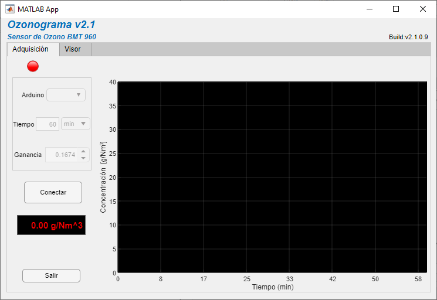
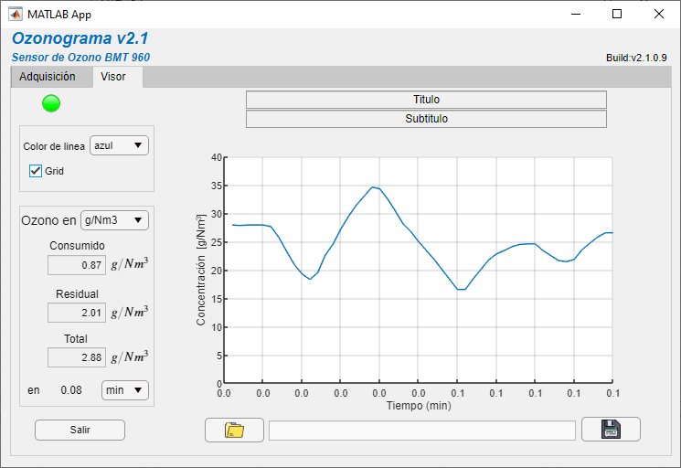

# Ozone Graph App v2.1.0.9
Aplicación para la adquisión de datos del sensor de ozono BMT 960 por medio de Arduino, para uso en el Laboratorio de Investigación en Ingeniería Química Ambiental (LAIIQA - ESIQIE - IPN).

## Adquisición

- Una vez conectado el arduino a la computadora, y al hacer click en `Conectar`, el programa se conetará automaticamente al puerto `COM` detectado del Arduino. Se recomienda desconectar cualquier otro dispositivo `USB`.

- El botón `Conectar` cambiará a `Iniciar` para comenzar la lectura de la señal.

## Visor de archivos

 - Al finalizar se puede observar el ozonograma generado en la pestaña `Visor`.

 - En el recuadro se muestra el ozono **Consumido**, **Residual** y **Total**, a un flujo de `0.5 L/min` con una concentración máxima aproximada de `35 g/Nm^3` (metros cúbicos Normales: 0°C a nivel del mar).

 - La opción `Color de linea` da a elegir entre 7 colores de línea distintos.

 - La opción `grid` activa o desactiva las líneas de cuadrícula del gráfico.

 - La opción `Ozono en ` `g/Nm^3 | g/L` cambia las unidades para el cálculo del ozono **Consumido**, **Residual** y **Total**.

 - El selector de tiempo en la parte inferior `min | seg` cambia la escala del eje x.

 - La barra de `Titulo` modifica el titulo del gráfico (**opcional**).

 - La barra de `Subtitulo` modifica el subtitulo del gráfico (**opcional**).

 - Con el botón `abrir` se pueden abrir archivos `.mat` creados previamente.

 - Con el botón `guardar` se puede guardar el ozonograma generado en los formatos: `.mat`, `.xlsx`, `.csv` y `.txt`.
